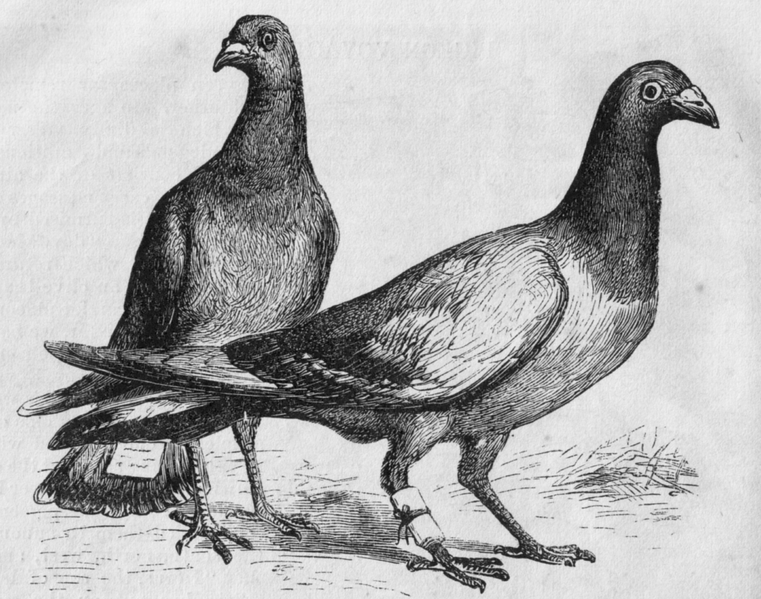
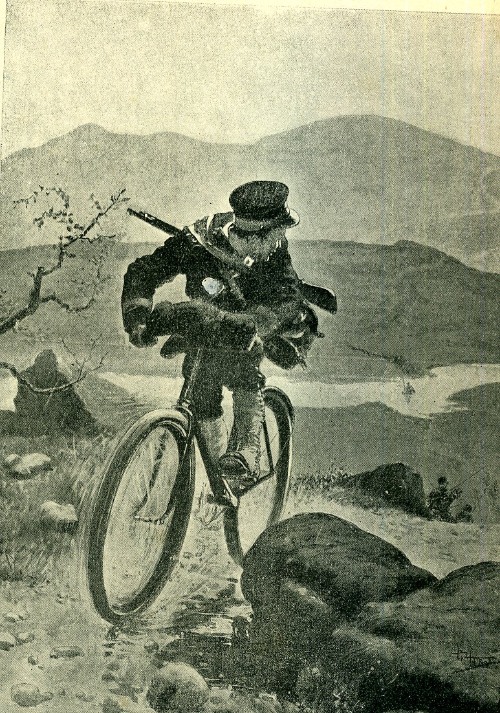
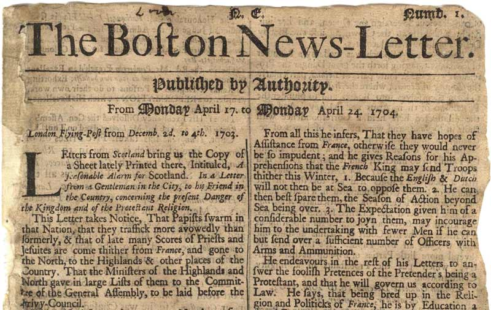
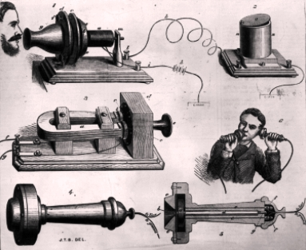
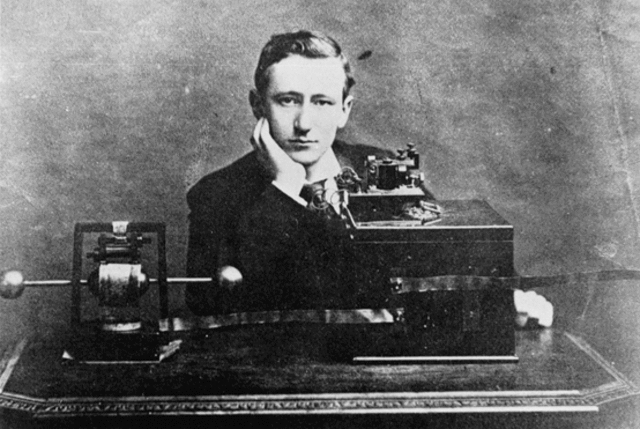

# Social-Technological-Cycle

## Social Media and Communication
#### By: Amanda Iverson

### Introduction

Communication is said to be the key to success. It is vital for a society to work together. From the beginning of time, communication has been a requirement for society as a whole to move forward. The interesting thing about communication thought is there are always new and exciting ways to achieve it.
 
 Currently, in 2018, people all across the globe utulize <strong> Social Media Platforms </strong>. These platforms live on our phones and laptops. We notify others in our networks of how our day is going and of any life changing events that may be occuring. We depend on social media to update us with world news and to recieve the opinions of those we admire. Needless to say, Social Media is extremely important for our current culture and society. It is important to really understand how social media and communication has changed since the beginning of time. 
 
 In this presesntation, I want to walk you through how communication has evolved from the beginning to our current day and age. Take into consideration though how society has adjusted accrodingly. Pay close attention to the evolution we see that once a new form is published, society doesn\'t really look back.

### Messenger

Before any technological breakthroughs, all forms of long-distance communication were passed through actual messengers through horseback, sail, and sometimes carrier pigeons. Often this resulted in emergency news taking much longer to notify the important parties than maybe necessary. It was unreliable, and slow to respond depending on how far of a distance the messenger was coming from.

  

### Newspapers

In the 1600s the first newspaper was released. Newspapers were extremely important because it provided a way for private citizens to get their points of view heard. The newspaper was one of the first ways that biased opinions could be communicated publicly. This was the first chance to have a piece of media influence the public and potentially sway large political decisions in the current society. 
 
In addition, Newspapers help spread important information across the nation. In the United States, it helped the west coast stay informed of what was happening on the east coast. Newspapers held a special power that was unlike anything that had been seen before. Newspapers had the ability to change the minds and influence public opinions on political parties, world events, and even local topics of interest.

 

### Telephone

 In 1890, the invention of the telephone was upon us. Alexander Gram Bell, the scientist behind the invention, wanted to improve the current telegraph, and make something that was a bit more reliable and easier to communicate. After hard work and persistence, Bell succeeded in the transmitting of human voice, known as the telephone.
 
 At first, phones were utilized by businesses only. They were mostly used for business transactions and commercial use. It wasn’t until the 1890s where they started to place into homes. This allowed for private and personal use. Families were able to call one another up and share news and updates of their lives without having to go through a messenger, or telegraph.
 
 The invention of the telephone alone was substantial for its time and moved technology forward by means of communication. No longer was there a dependency on written words or codes, now it was possible to communicate through voice!
 
 
'

### Radio

Much like the newspapers, the radio held its own influence. The radio was one of the first forms of “wireless communication”, invented in the 1890s, mostly based off of the famous Telegraph that was invented in 1792. The radio mostly utilized to communicate and send transmissions through land, sea, and train. 
 
The real value of radio really came to be possible in 1912, after the sinking of the Titanic, did the United States create “The Radio Act of 1912” that mandated all radio stations in the United States be licensed by the federal government, as well as mandating that seagoing vessels continuously monitor distress frequencies. The idea being, this incident of the Titanic could have been prevented, and radios offer that ability to call and seek help should another incident occur. 
 
 It wasn’t until the mid to late 1920s that the radio became a mainstream household item for the means of entertainment. Homes all over the world contained a radio to listen to music, listen to broadcasts, and listen to the current world news. Live broadcasts were extremely popular because it was an opportunity for households to get real time information as a family and stay informed on the most current events.  Some of the most popular live radio broadcasts include The Hindenburg Disaster in 1938, The War of the Worlds Broadcast (Oct. 30 1938), and Martin Luther King “I have a dream” speech in 1963.

 
 

### Social Media

The internet itself had a huge impact on how communication between individuals occurred. This allowed for someone to talk and interact with another, regardless the number of miles, states, or countries that separated them.
 
 Over the past 18 years, many social media sites have come and gone, but 3 in particular have lasted the longest: LinkedIn, Facebook, and Twitter.

  
LinkedIn launched December of 2002. LinkedIn is all about connection professionals with employers. It is a dedicated space that employers could browse through potential employees, look at their resumes, publish job postings, and communicate out to all of the users of any new exciting information the company has to tell. LinkedIn changed the game on how people get jobs. They make it easier to network and collaborate with individuals at different companies, and easier for recruiters to find qualified candidates. Over the past 15 years, LinkedIn has been a huge success and made a significant impact connecting employers with employees.
 
 
 Founded in February 2004, Facebook was launched as a social media platform. By 2006, it was the #1 social media platform chosen by users. Facebook specialized in connecting users to one another (called “friends”), allowed upload of both videos and pictures to their profile, and eventually to allow businesses to market and advertise their products and services. 
  
Founded in March of 2006 is an online news and social networking services. Users send each other messages through “tweets”. This platform is especially groundbreaking because it allows for instant up to date messages to be sent. Previously the limit of each “tweet” was 140 characters. This ensured that only relevant, small bits of information were transferred. As of November of 2017, this limit has since doubled, allowing more room and ability to send out longer messages. 

### Conclusion

 All of these social media platforms have had a huge impact on society and have had a huge success in impacting society and how it works. The reason for this is because the number of users that are invested into this form of communication. Facebook itself has allowed the ability for families who do not live near each other to stay connected through “private groups” and “instant messages”. It allows for old friends you haven’t seen a in long time to keep in touch. Facebook itself has brought back the possibility that you don’t have to live near or talk to someone everyday for the connection to stay strong. 
 
 Twitter on the other hand, has had a much larger impact. Many people use Twitter as a means of communication for world events. When something tragic happens, it can traditionally take a long time for news events to catch and publish the story. Twitter gives anyone with an account the ability to “tweet” it out, and the information to be shared instantly. Many people of significance and power use their Twitter accounts to publish personal opinions, while others use it to break news stories first while the new channels gather more information before writing a story. Communication as a whole has come a long way since the beginning of time. The need for communication is strong, and it has the ability to save lives. We depend so heavily on our communication devices and platforms, that social media has become a staple part of our lives in society. 

